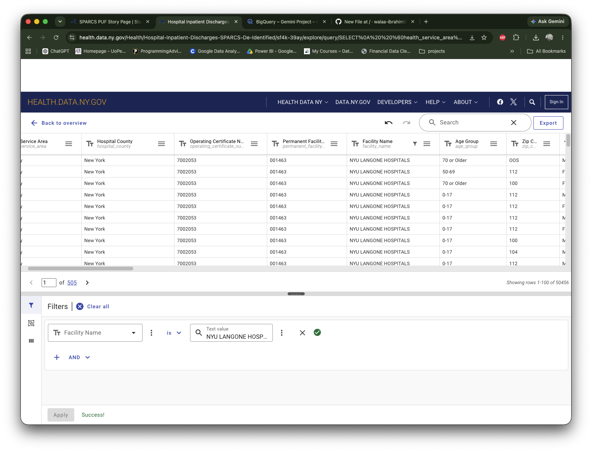

# nyu-hospital-analytics
Healthcare data analytics project using 2024 NYS SPARCS inpatient discharge data and Google BigQuery SQL.

## Data Source

This project uses the **Hospital Inpatient Discharges (SPARCS De-Identified): 2024** dataset provided by the New York State Department of Health.

The dataset contains discharge-level information including patient characteristics, diagnoses, treatments, services, and charges.

**Official Source:**  
New York State Department of Health – Health Data NY
https://health.data.ny.gov/stories/s/SPARCS-PUF-Story-Page/wvua-rr23/

## Data Preparation

The 2024 SPARCS inpatient discharge dataset was filtered to include only records for `NYU LANGONE HOSPITALS`.

**Records used: 50,456**

**Dataset:** Hospital Inpatient Discharges (SPARCS De-Identified): 2024

For this project, the dataset was filtered to:

- Facility Name: `NYU LANGONE HOSPITALS`
- Discharge Year: `2024`
- Records used: `50,456`

